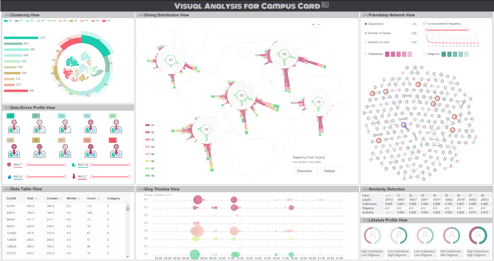

## Behavioural Visual Analysis Based on Campus Card Data

### Abstract
 With the advent of the era of big data, data visualization provides new ideas and technical support for innovation funding work. It also brings new opportunities for innovative campus management. The main contents of this paper are as follows.1) Using data mining and visual analysis technology to explore students’ consumption behavior. 2) Aiming at the special events of COVID-19, realized the planning and simulation of the peak-staggered dining after the epidemic to help prevent and control the epidemic in colleges and universities. 3) Construct a bipartite network based on consumption data and map it to obtain a peer relationship network, and explore the impact of peer relationship on students' academic performance from the perspective of network topology. This article aims to provide a more scientific basis and reference for schools to optimize resource allocation and scientific decision-making, and has potential value and great significance in the construction and management of smart campus.

### Visual System

 
