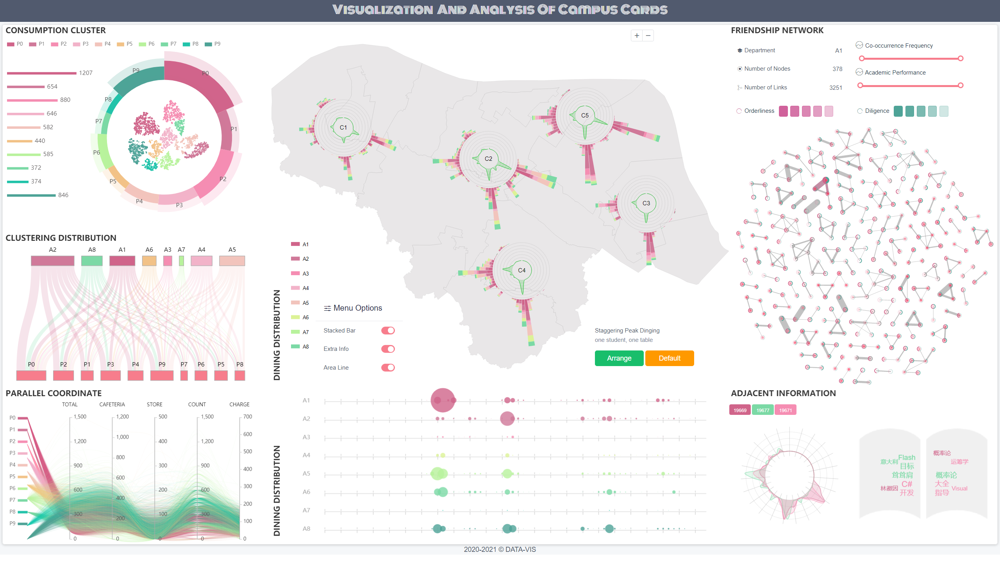
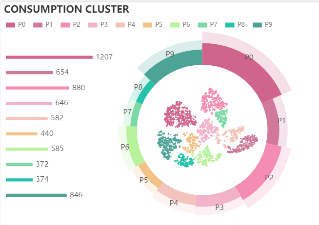
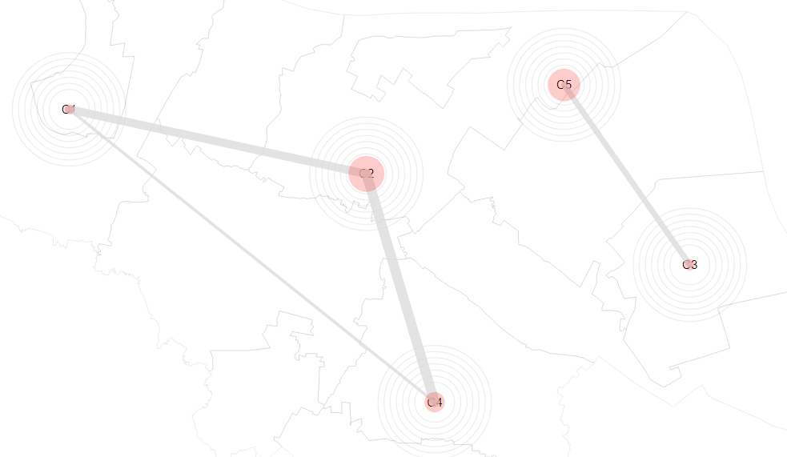
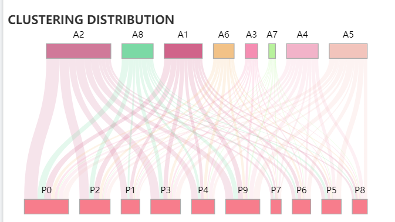
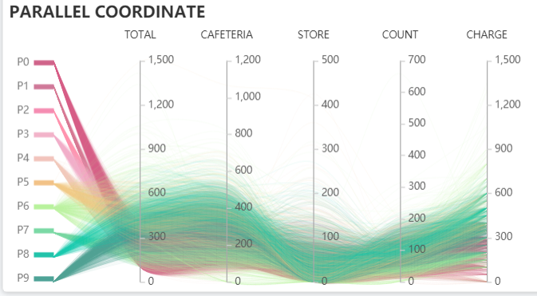
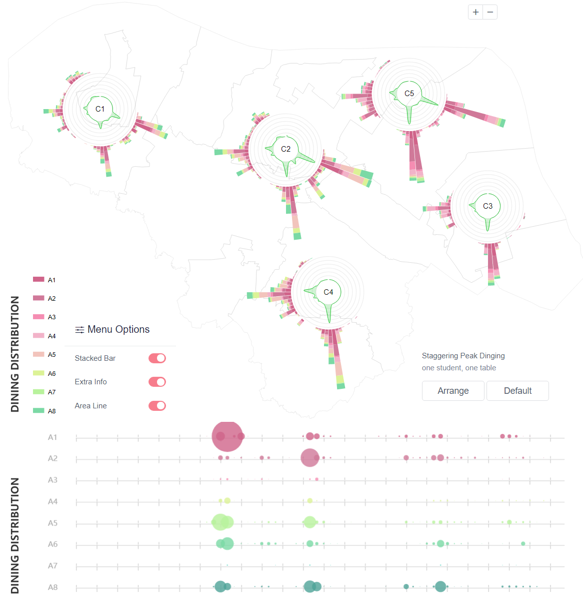
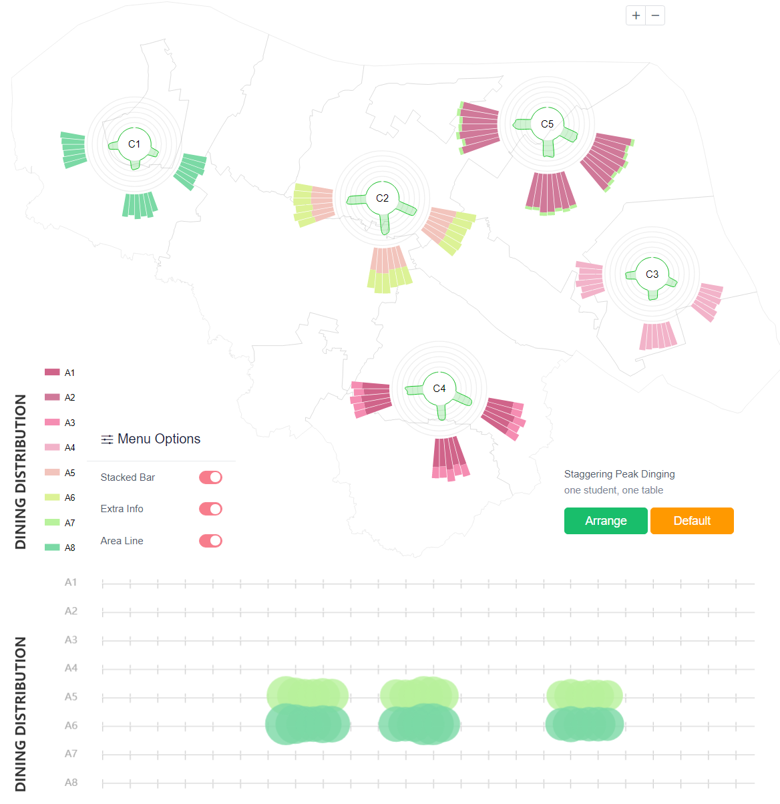
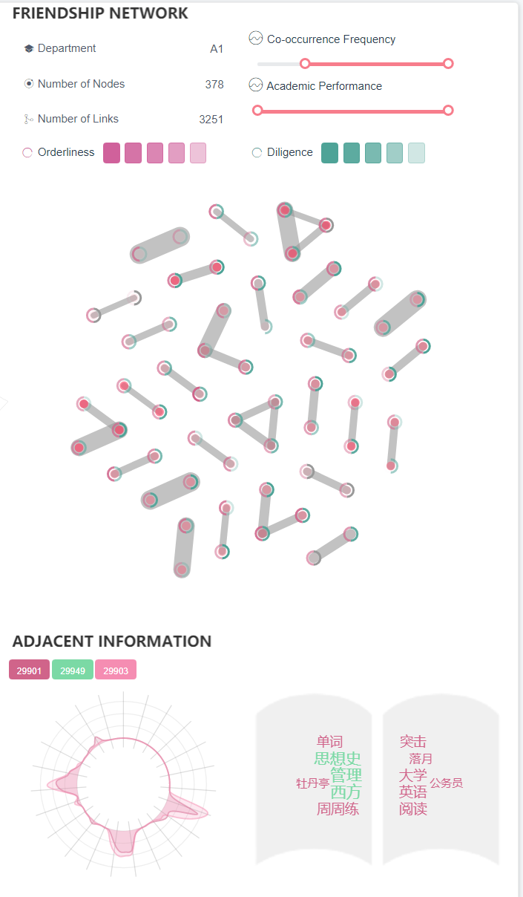

# 基于校园卡系统的行为可视分析

### Abstract

随着大数据时代的来临，数据可视化为创新资助工作提供了新的理念和技术支持，也为高校创新学生管理工作带来了新的机遇。本文的主要工作内容有：
1@待定
2@待定
3@待定
本文旨在为学校优化资源配置和科学决策提供更科学的依据和参考，在智慧校园建设管理中的具有潜在价值和重大意义。

### TASK

#### 针对什么问题？ 解决了什么问题？

-----------------------------------------------------

### System Interface

------------------------------------------------------

#### TASK01

Description: 基于校园卡消费数据记录，利用数据挖掘与可视分析技术探索不同消费群体消费特征与消费偏好，为精准资助提供参考。

**`数据预处理`** 从校园卡数据中提取学生的消费数据记录，并对数据进行预处理。

**`特征向量计算`** 计算每个学生的消费特征向量，包括消费总额、食堂消费总额、超市消费总额、消费次数、充值金额等。

**`聚类`** 基于学生消费特征向量进行聚类，采用凝聚聚类算法，将学生群体分为10个类别。

**`频繁轨迹`**

**`可视化设计`** 消费聚类展示 + 群体就餐地点偏好 + 群体分布 + 消费特征平行坐标

 **View1 消费聚类展示**

 **View2 群体就餐地点偏好**

 **View3 群体分布**

 **View4 消费特征平行坐标**

#### TASK02

#### TASK03

