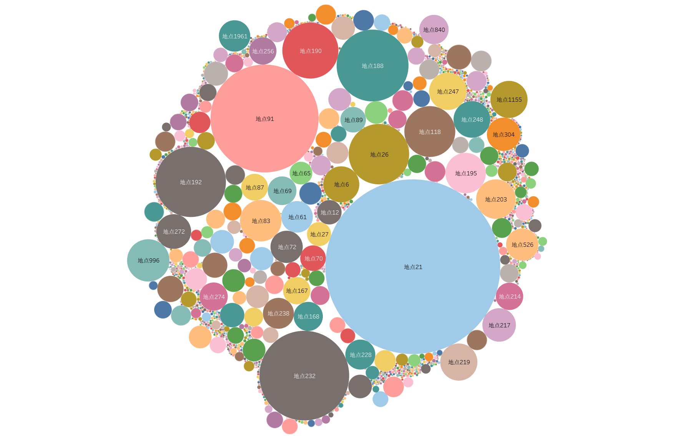
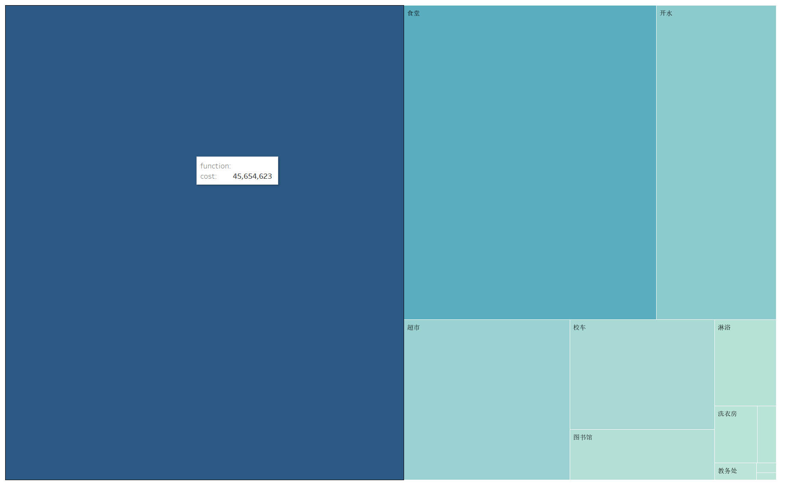
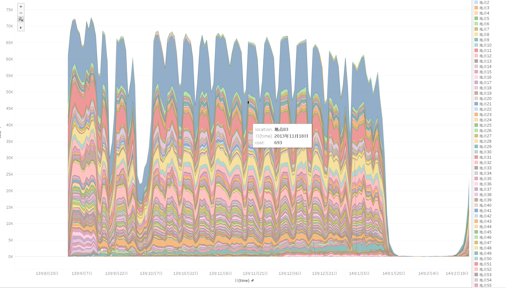
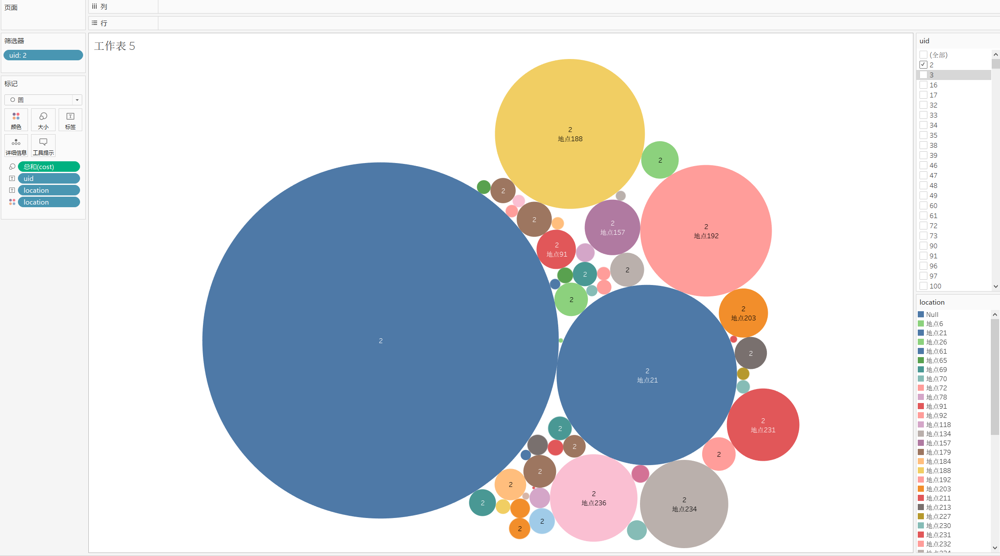
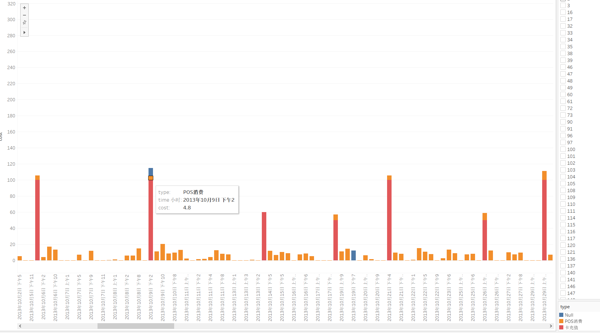
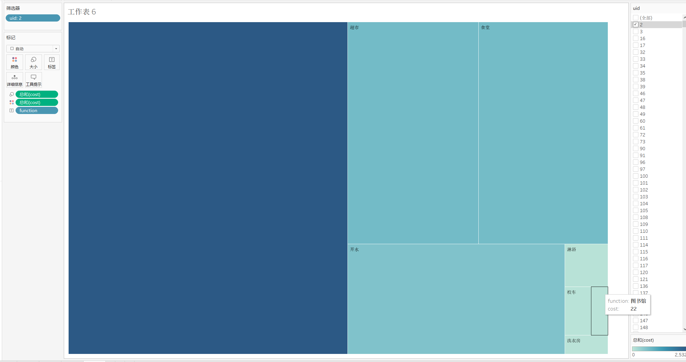

# Campus ECards Visualization Analysis

## Background

校园一卡通是集身份认证、金融消费、数据共享等多项功能于一体的信息集成系统。在为师生提供优质、高效信息化服务的同时，系统自身也积累了大量的历史记录，其中蕴含着学生的消费行为以及学校食堂等各部门的运行状况等信息。很多高校基于校园一卡通系统进行“智慧校园”的相关建设。由于该类数据体量大、数据类型多等特点，使得传统的数据分析技术已经难以有效进行分析处理。如何将可视分析技术应用于校园一卡通数据分析中，分析学生在校园内的学习生活行为，为改进学校服务并为相关部门的决策提供信息支持是一个新颖的研究课题。

大数据时代的来临，数据可视化为创新资助工作方式提供了新的理念和技术支持，也为高校利用大数据推进快速、便捷、高效精准资助工作带来了新的机遇。基于学生每天产生的一卡通实时数据，利用大数据挖掘与分析技术、数学建模理论帮助管理者掌握学生在校期间的真实消费情况、学生经济水平、发现“隐性贫困”与疑似“虚假认定”学生，从而实现精准资助，让每一笔资助经费得到最大价值的发挥与利用，帮助每一个贫困大学生顺利完成学业。因此，基于学生在校期间产生的消费数据运用大数据挖掘与分析技术实现贫困学生的精准挖掘具有重要的应用价值。

## Data

数据为某高校2013~2014、2014~2015两学年的学生在校行为数据作为原始数据，包括消费数据、图书借阅数据、寝室门禁数据、图书馆门禁数据、学生成绩排名数据。

注：数据中所有的记录均为“原始数据记录”直接经过脱敏而来，可能会存在一些重复的或者是异常的记录

### ① 图书借阅数据borrow*

注：有些图书的编号缺失。

字段描述和示例如下（第三条记录缺失图书编号）：

| 学生id | 借阅日期   | 图书名称                                                     | 图书编号          |
| ------ | ---------- | ------------------------------------------------------------ | ----------------- |
| 9708   | 2014/2/25  | "我的英语日记/ (韩)南银英著 (韩)卢炫廷插图"                  | "H315  502"       |
| 6956   | 2013/10/27 | "解读联想思维: 联想教父柳传志"                               | "K825.38=76  547" |
| 9076   | 2014/3/28  | "公司法 gong si fa  = = Corporation law / 范健，王建文著 eng" | null              |

### ②  一卡通数据card*

字段描述和示例如下：

| 学生id | 消费类别  | 消费地点  | 消费方式 | 消费时间               | 消费金额 | 剩余金额 |
| ------ | --------- | --------- | -------- | ---------------------- | -------- | -------- |
| 1006   | "POS消费" | "地点551" | "淋浴"   | "2013/09/01  00:00:32" | "0.5"    | "124.9"  |
| 1406   | "POS消费" | "地点78"  | "其他"   | "2013/09/01  00:00:40" | "0.6"    | "373.82" |
| 13554  | "POS消费" | "地点6"   | "淋浴"   | "2013/09/01  00:00:57" | "0.5"    | "522.37" |

### ③ 寝室门禁数据dorm*

字段描述和示例如下：

| 学生id， | 具体时间               | 进出方向(0进寝室，1出寝室) |
| -------- | ---------------------- | -------------------------- |
| 13126    | "2014/01/21  03:31:11" | "1"                        |
| 9228     | "2014/01/21  10:28:23" | "0"                        |

### ④ 图书馆门禁数据library*

注：图书馆的开放时间为早上7点到晚上22点，门禁编号数据在2014/02/23之前只有“编号”信息，之后引入了“进门、出门”信息，还有些异常信息为null

字段描述和示例如下：

| 学生id | 门禁编号 | 具体时间               |
| ------ | -------- | ---------------------- |
| 3684   | "5"      | "2013/09/01  08:42:50" |
| 7434   | "5"      | "2013/09/01  08:50:08" |
| 8000   | "进门2"  | "2014/03/31  18:20:31" |
| 5332   | "小门"   | "2014/04/03  20:11:06" |
| 7397   | "出门4"  | "2014/09/04  16:50:51" |

### ⑤ 学生成绩数据score*

注：成绩排名的计算方式是将所有成绩按学分加权求和，然后除以学分总和，再按照学生所在学院排序。

字段描述和示例如下：

| 学生id | 学院编号 | 成绩排名 |
| ------ | -------- | -------- |
| 0      | 9        | 1        |
| 1      | 9        | 2        |
| 8      | 6        | 1565     |
| 9      | 6        | 1570     |

### ⑥ 助学金数据subsidy*

字段描述和示例如下：

| 学生id | 助学金金额（分隔符为半角逗号） |
| ------ | ------------------------------ |
| 10     | 0                              |
| 22     | 1000                           |
| 28     | 1000                           |
| 64     | 1500                           |
| 650    | 2000                           |

## Task//////////////////////////////

设计开发针对校园一卡通数据的学生消费行为可视化系统，实现功能包括但不限如下：

（1）分析不同学院学生消费行为特点与时空偏好；

（2）评估各食堂以及超市的运营状况，为食堂以及超市运营提供参考建议；

（3）挖掘学生消费特征与日常行为轨迹的关联关系；

（4）探索低消费学生群体的行为特征，为学校助学金评定提供参考建议。

## Schedual

| date   | id       | description |
| ------ | -------- | -------- |
| 2019/01/10   | Lelliam        | 数据处理ing，数据预处理得出数据的部分信息      |

## Data Processing

地点cost总和

功能消费总和

地点消费时序变化

 个人地点偏好

个人消费情况

个人主要消费项目

